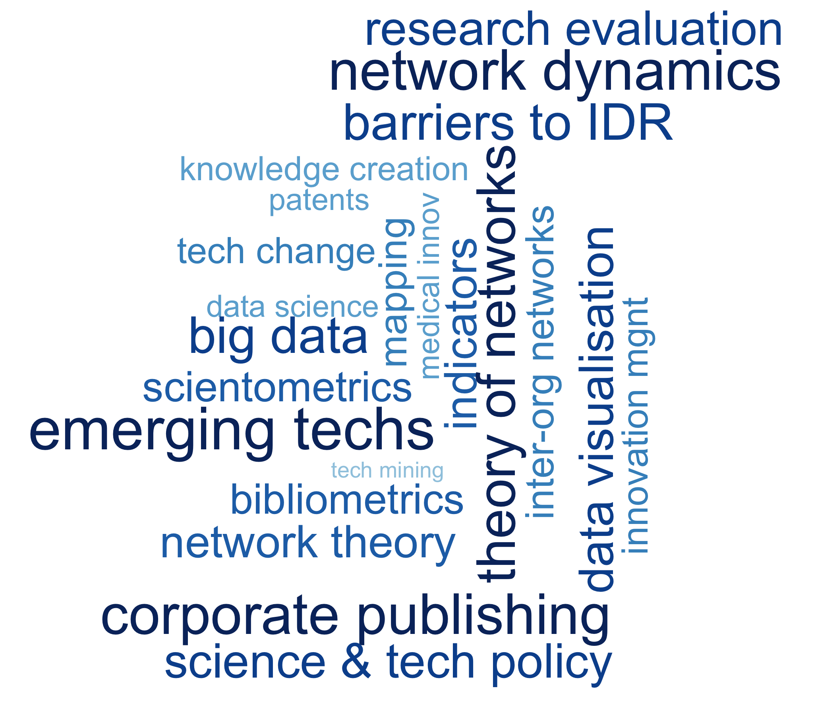
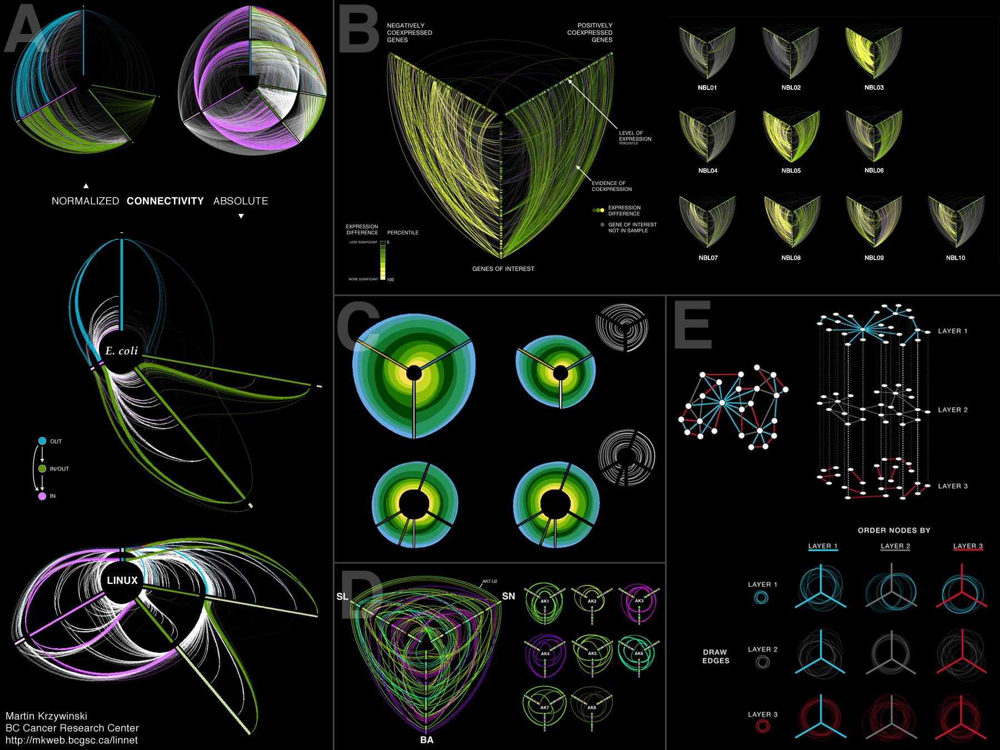
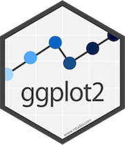

```{r setup, include=FALSE}
knitr::opts_chunk$set(echo = FALSE)
```


<!------------------------------------------>
<!-- Outline ------------------------------->
<!------------------------------------------>
# Outline

## Outline
- Why visualising data?
- Visualisation types
- Beyond statistics and visualisation
- Data visualisation in R


<!------------------------------------------>
<!-- Why visualising data? ----------------->
<!------------------------------------------>
# Why visualising data?


## Why visualising data?
<div style="float: left; width: 70%;">
<center>
{width=65%}
</center>

<center>
<font size="3">Source: Figurative drawings of the Grotte Chauvet-Pont d’Arc, 30,000-32,000 BP (http://whc.unesco.org/)</font>
</center>
</div>

<div style="float: right; width: 30%;">
* Half of our brain is dedicated to processing **visual signals** 
* We can process images **60,000 times faster** than text
</div>


## Why visualising data?
* Increasing capabilities to collect, store and analyse data 
  + government data
  + APIs
  + ...
* [Large amount of real time data](https://www.webfx.com/internet-real-time/)
* Risk of **information overload**
* **Data visualisation**
  + to simplify the complexity
  + to identify actual and misleading patterns


## ... to simplify the complexity
<center>
{width=75%}
</center>

<center>
<font size="3">Source: https://opensyllabus.org</font>
</center>


## ... to simplify the complexity
<center>
{width=80%}
</center>

<center>
<font size="3">Source: Il Sole 24 Ore, November 2008</font>
</center>


## ... to simplify the complexity
<center>
{width=95%}
</center>

<center>
<font size="3">Source: @VanderMeer2013</font>
</center>


## ... to identify actual and misleading patterns {.flexbox .vcenter}
<center>
{width=80%}
</center>


## ... to identify actual and misleading patterns{.flexbox .vcenter}
<center>
{width=40%}
</center>

<center>
<font size="3">Source: @Jackman1980</font>
</center>


## ... to identify actual and misleading patterns
* [Jan Vanhove](https://janhove.github.io/teaching/2016/11/21/what-correlations-look-like) has provided a script in R to explore the diversity of patterns that may lie behind a simple correlation measure
* You can specify the correlation (`r`) and the number of observations (`n`)

```{r eval=FALSE, echo =TRUE}
source("http://janhove.github.io/RCode/plot_r.R")
plot_r(r = 0.1, n = 50)
```


## ... to identify actual and misleading patterns {.flexbox .vcenter}
```{r echo=FALSE, message=FALSE, warning=FALSE, fig.height=5.5, fig.width=9}
source("http://janhove.github.io/RCode/plot_r.R")
plot_r(r = 0.1, n = 50)
```


## ... to identify actual and misleading patterns {.flexbox .vcenter}
```{r echo = FALSE, message=FALSE, warning=FALSE, fig.height=5.5, fig.width=9}
source("http://janhove.github.io/RCode/plot_r.R")
plot_r(r = 0.5, n = 50)
```


## ... to identify actual and misleading patterns {.flexbox .vcenter}
```{r echo = FALSE, message=FALSE, warning=FALSE, fig.height=5.5, fig.width=9}
source("http://janhove.github.io/RCode/plot_r.R")
plot_r(r = 0.8, n = 50)
```


<!------------------------------------------>
<!-- Visualisation types ------------------->
<!------------------------------------------>
# Visualisation types


## Visualisation types
**Visualisation types** by @Borner2016

* **Tables:** values arranged in rows and columns (e.g. summary tables)
* **Charts:** qualitative and quantitative representations of data without a reference system (e.g. pie charts)
* **Graphs:** qualitative and quantitative representations of data with a reference system (e.g. scatterplot)
* **Maps:** geographical distribution of data (e.g. geographical maps)
* **Networks layouts:** data represented as sets of nodes and links between these, i.e. relationships between nodes (e.g. co-occurrence networks)


## Visualisation types
<div style="float: left; width: 60%;">
* One type of visualisation can be **converted** into another (e.g. a pie chart can be transformed into a bar chart)
* Different visualisation types can be **combined** to examine data from different a number of angles
* See @Harris1996 for a comprehensive list of **visualisation types**
</div>

<div style="float: right; width: 40%;">
<center>
{width=60%}
</center>
</div>


## Tables: *One way*{.flexbox .vcenter}
<center>
{width=60%}
</center>

<center>
<font size="3">Source: @Harris1996</font>
</center>


## Tables: *Two way*{.flexbox .vcenter}
<center>
{width=50%}
</center>

<center>
<font size="3">Source: @Harris1996</font>
</center>


## Tables: *3D*{.flexbox .vcenter}
<center>
{width=50%}
</center>

<center>
<font size="3">Source: @Harris1996</font>
</center>


## Tables: ... {.flexbox .vcenter}
<center>
*... many other variations*
</center>


## Tables: *Terminology*{.flexbox .vcenter}
<center>
{width=70%}
</center>

<center>
<font size="3">Source: @Harris1996</font>
</center>


## Charts: *Pie charts*{.flexbox .vcenter}
<center>
{width=60%}
</center>

<center>
<font size="3">Source: @Borner2016</font>
</center>


## Charts: *Bubble charts*{.flexbox .vcenter}
<center>
{width=70%}
</center>

<center>
<font size="3">Source: [Gates Foundation's education-based donations]( https://vallandingham.me/bubble_charts_in_js.html) (color and size represent grant amount)</font>
</center>


## Charts: *Word clouds*{.flexbox .vcenter}
<center>
{width=60%}
</center>


## Charts: ...{.flexbox .vcenter}
<center>
*... many other variations*
</center>


## Graphs: *Bubble graphs*{.flexbox .vcenter}
<center>
{width=70%}
</center>

<center>
<font size="3">Source: https://www.gapminder.org</font>
</center>


## Graphs: *Line graphs*{.flexbox .vcenter}
<center>
{width=65%}
</center>

<center>
<font size="3">Source: @Bone2020</font>
</center>


## Graphs: *Line and bar graphs*{.flexbox .vcenter}
<center>
{width=65%}
</center>

<center>
<font size="3">Source: https://www.nih.gov/news-events/nih-research-grants-digital-press-kit</font>
</center>

## Graphs: *Interactive bar graphs*{.flexbox .vcenter}
<center>
{width=100%}
</center>

<center>
<font size="3">Source: Winners and Losers: Job Gains and Losses, [Wall Street Journal](http://graphics.wsj.com/job-market-tracker/)</font>
</center>


## Graphs: *Box plot*{.flexbox .vcenter}
<center>
{width=57%}
</center>

<center>
<font size="3">Source: @Camerani2018</font>
</center>


## Graphs: *Statistical visualisations*{.flexbox .vcenter}
```{r echo=TRUE, message=FALSE, warning=FALSE, fig.height=5.5, fig.width=9}
library(tidyverse)
library(GGally)
load(file = "organdata.rda")

organdata_sm <- organdata %>%
  select(donors, pop_dens, pubhealth,
         roads, consent_law)

g <- ggpairs(data = organdata_sm,
             mapping = aes(color = consent_law, alpha = 0.5),
             upper = list(continuous = wrap("density"), combo = "box_no_facet"),
             lower = list(continuous = wrap("points"), combo = wrap("dot_no_facet")))

```

## Graphs: *Statistical visualisations*{.flexbox .vcenter}
```{r echo=FALSE, message=FALSE, warning=FALSE, fig.height=5.5, fig.width=9}
print(g)
```


## Graphs: ...{.flexbox .vcenter}
<center>
*... many other variations*
</center>


## Maps: *Cartograms*{.flexbox .vcenter}
<center>
{width=70%}
</center>

<center>
<font size="3">Source: https://geographical.co.uk/places/mapping/item/2276-mapping-the-2017-general-election</font>
</center>


## Maps: *Choropleth maps*{.flexbox .vcenter}
<center>
{width=70%}
</center>

<center>
<font size="3">Source: https://www.nytimes.com/interactive/2019/08/02/us/politics/2020-democratic-fundraising.html </font>
</center>


## Maps: *Choropleth maps*{.flexbox .vcenter}
<center>
{width=70%}
</center>

<center>
<font size="3">Source: https://www.nytimes.com/interactive/2019/08/02/us/politics/2020-democratic-fundraising.html </font>
</center>


## Maps: *Choropleth maps*{.flexbox .vcenter}
<center>
{width=60%}
</center>

<center>
<font size="3">Source: https://timogrossenbacher.ch/2019/04/bivariate-maps-with-ggplot2-and-sf/</font>
</center>


## Maps: *Choropleth maps*{.flexbox .vcenter}
<center>
{width=90%}
</center>

<center>
<font size="3">Source: https://centerforcollectivelearning.org/urbanperception</font>
</center>


## Maps: *Proportional symbol maps*{.flexbox .vcenter}
<center>
{width=90%}
</center>

<center>
<font size="3">Source: Active COVID-19 cases on 5 Ocotber 2021 (https://www.gisaid.org/epiflu-applications/global-cases-covid-19/)</font>
</center>


## Maps: ...{.flexbox .vcenter}
<center>
*... many other variations*
</center>


## Network layouts: *Trees*{.flexbox .vcenter}
<center>
{width=35%}
</center>

<center>
<font size="3">Source: 1296 Ramon Llull's **arbor scientiae** (tree of science)</font>
</center>


## Network layouts: *Trees*{.flexbox .vcenter}
<center>
{width=100%}
</center>

<center>
<font size="3">Source: Tree of life (www.evogeneao.com)</font>
</center>


## Network layouts: *Tree maps*{.flexbox .vcenter}
<center>
{width=90%}
</center>

<center>
<font size="3">Source: https://pantheon.world</font>
</center>


## Network layouts: *Sankey diagrams*{.flexbox .vcenter}
<center>
{width=95%}
</center>

<center>
<font size="3">Source: UK energy production and consumption in 2050 ([Department of Energy & Climate Change](https://github.com/d3/d3-sankey))</font>
</center>


## Network layouts: *Geographical networks*{.flexbox .vcenter}
<center>
{width=100%}
</center>

<center>
<font size="3">Source: Co-authorship at the city level (SCOPUS 2008-2012) (http://olihb.com)</font>
</center>


## Network layouts: *Citation networks*{.flexbox .vcenter}
<center>
{width=70%}
</center>

<center>
<font size="3">Source: [Nature, November 2019](https://youtu.be/GW4s58u8PZoProduct)</font>
</center>


## Network layouts: *Networks*{.flexbox .vcenter}
<center>
{width=55%}
</center>

<center>
<font size="3">Source: Product space [@Hausmann2013]</font>
</center>


## Network layouts: *Hive plots*{.flexbox .vcenter}
<center>
{width=70%}
</center>

<center>
<font size="3">Source: https://www.gov.uk/government/collections/special-advisers-transparency-publications</font>
</center>


## Network layouts: *Hive plots*{.flexbox .vcenter}
<center>
{width=65%}
</center>

<center>
<font size="3">Source: http://hiveplot.com</font>
</center>


## Network layouts: ...{.flexbox .vcenter}
<center>
*... many other variations*
</center>


<!------------------------------------------>
<!-- Graphical symbols and variables ------->
<!------------------------------------------>
# Graphical symbols and variables


## Graphical symbols
* **Graphical symbols** are graphical representations of data information 
* **Types**
  + *Geometric*: point, line, area, surface, volume
  + *Linguistic*: text, numerals, punctuation marks
  + *Pictorial*: images, icons, statistical glyph


## Graphical variables
<div style="float: left; width: 60%;">
* **Graphic variables** are used to encode additional data
* **Types**
  + **Spatial:** Position (x, y , z)
  + **Retinal:**
    + *Form*: size, shape, rotation, curvature, angle, closure, 
    + *Color*: value, hue, saturation ([colorbrewer](https://colorbrewer2.org))
    + *Texture*: spacing, pattern, granularity, gradient
    + *Optics*: blur, transparency, shading 
    + *Motion*: speed, velocity, rhythm
</div>

<div style="float: right; width: 40%;">
<center>
{width=75%}
</center>

<center>
<font size="3">Source: Perception Accuracy [@Borner2016]</font>
</center>
</div>


## Graphical symbols and variables{.flexbox .vcenter}
<center>
{width=100%}
</center>

<center>
<font size="3">Source: [Atlas of Science](http://scimaps.org/images/publications/atlas2/lg/036-037-Graphic-Variable-Vs-Graphic-Symbol-Types.pdf) [@Borner2016]</font>
</center>


## Graphical symbols and variables {.flexbox .vcenter}
<center>
{width=100%}
</center>

<center>
<font size="3">Source: [Atlas of Science](http://scimaps.org/images/publications/atlas2/lg/038-039-Graphic-Variable-Vs-Graphic-Symbol-Types-Cont.pdf) [@Borner2016]</font>
</center>


## Data-ink ratio
<div style="float: left; width: 60%;">
The concept of **data-ink ration** has been introduced by @Tufte2001

* Most of the 'ink' used to print a graphic should represent data-information
* **Data-ink** is defined as the part of the graphic that we cannot erase without losing information
* **Data-ink ratio** is defined as the proportion of a graphic’s ink devoted to the display of non-redundant information (data-ink)

</div>

<div style="float: right; width: 40%;">
<center>
{width=90%}
</center>
</div>


## Data-ink ratio
<center>
{width=45%}
</center>

<center>
<font size="3">Source: Fundamentals of electroencephalography [@Tufte2001]</font>
</center>


## Data-ink ratio
<center>
{width=70%}
</center>

<center>
<font size="3">Source: England's import/export from and to North America from 1770 to 1782 [@Tufte2001]</font>
</center>


## Data-ink ratio
<center>
{width=60%}
</center>

<center>
<font size="3">Source: John Tyler Bonner. 1975. Size and Cycle: An Essay on the Structure of Biology, Princeton Legacy Library [@Tufte2001]</font>
</center>

<!------------------------------------------>
<!-- Beyond statistics and visualisation --->
<!------------------------------------------>
# Beyond statistics and visualisation


## Triggering emotions
* **Raw data** do not tell as much
* Statistics and visualisation help us to go **beyond raw data** to see patterns, and relationships between variables
* **Data visualisation** helps us to communicate this into a story and to trigger emotions and actions
* It is crucial to consider your audience


## Triggering emotions
* Watch **Hans Rosling**'s videos
* BBC: [200 years in 4 minutes](https://youtu.be/Z8t4k0Q8e8Y)
* TED talk: [Global Population Growth, Box by Box](https://www.ted.com/talks/hans_rosling_global_population_growth_box_by_box?language=en)
* TED talk: [Asia's Rise = How and When](https://www.ted.com/talks/hans_rosling_asia_s_rise_how_and_when#t-184291)


<center>
{width=40%}
</center>

<center>
<font size="3">Source: [New York Times](https://www.nytimes.com/2017/02/09/world/europe/hans-rosling-dead-statistician.html), 9 February 2017 
</font>
</center>


## Graphical integrity
* Graphics are a form of **data communication**
* Graphics may **(intentionally or unintentionally) distort** this communication and therefore the underlying data
* The **visual perception** has to be assessed carefully

<br></br>

<center>
$\text{Lie factor}=\frac{\text{Size of effect shown in graphic}}{\text{Size of effect in data}}$
</center>

<br></br>

* A **lie factor** greater than 1.05 or smaller than 0.95 introduces a significant distortion


## Graphical integrity
<center>
{width=100%}
</center>

<center>
<font size="3">Source: New York Times, August 9, 1978 [@Tufte2001]</font>
</center>


## Graphical integrity
<center>
$\text{Size of effect in data} = (27.5-18.0)/18.0 =  0.53$

<br></br>

$\text{Size of effect shown in graphic} = (5.3-0.6)/0.6 = 0.783$

<br></br>

$\text{Lie factor} = 0.783/0.53 =14.8$
</center>


## Graphical integrity
<center>
{width=50%}
</center>

<center>
<font size="3">Source: Campaign ad in Islington South (https://electionleaflets.org/brb.html)</font>
</center>


## Graphical integrity
<center>
{width=50%}
</center>

<center>
<font size="3">Source: Twitter (March, 2017)</font>
</center>


<!------------------------------------------>
<!-- Data visualisation in R --------------->
<!------------------------------------------>
# Data visualisation in R


## Data visualisation in R
* The most popular package is `ggplot2`
* Developed by **Hadley Wickham** and colleagues
* It is based on the **Grammar of Graphics**: components that can be composed in different manners (like a LEGO)
* It works in **layers of graphics**
* Layers map data into aesthetic attributes (e.g. color, shape, size) of geometric objects (e.g. points, lines, bars), or in other words **graphical symbols and variables**

<center>
{width=15%}
</center>


## Elements of `ggplot2`
* **Data** to visualise and a set of aesthetic (`aes`) mappings (e.g. x, y, group)
* **Layers** of geometric elements (`geom`) and statistical transformation (`stat`)
* **Scales** which allow us to read the data from the plot (legend and axis)
* A system of **coordinates** (e.g. coordinates of observations, gridlines)
* **Faceting** to describe how data are separated in different subsets
* **Theme** (e.g. size, background colors)

## Elements of `ggplot2`
<center>
{width=100%}
</center>


<center>
<font size="3">Source: https://api.rpubs.com/NemiVoraR/511391</font>
</center>


## `ggplot2` cheat sheet {.flexbox .vcenter}
<center>
{width=65%}
</center>


<center>
<font size="3">Source: https://rstudio.com/resources/cheatsheets </font>
</center>


## `ggplot2` cheat sheet {.flexbox .vcenter}
<center> 
{width=65%}
</center>


<center>
<font size="3">Source: https://rstudio.com/resources/cheatsheets </font>
</center>


## `ggplot2` in practice  {.flexbox .vcenter .smaller}
* We focus on the `mpg` dataset: `cty` (mpg for driving), `hwy` (mpg for highway driving), `displ` (engine displacement in liters), `drv` (drivetrain: front wheel [f], rear wheel [r] or four wheel [4]), `model` (car model), `class` (two seater, SUV, compact, etc.)

```{r echo=TRUE, message=FALSE, warning=FALSE}
library(ggplot2)
print(mpg, n = 4)
```


## `ggplot2` in practice: one variable {.flexbox .vcenter .smaller}
```{r echo=TRUE, message=FALSE, warning=FALSE, fig.height=4, fig.width=9}
ggplot(data = mpg, aes(x = displ, y = hwy)) + 
  geom_point()
```


## `ggplot2` in practice: one variable {.flexbox .vcenter .smaller}
```{r echo=TRUE, message=FALSE, warning=FALSE, fig.height=4, fig.width=9}
ggplot(data = mpg, aes(hwy)) + 
  geom_histogram(binwidth = 1, color = "white", fill = "blue", alpha = 0.4)
```


## `ggplot2` in practice: one variable {.flexbox .vcenter .smaller}
```{r echo=TRUE, message=FALSE, warning=FALSE, fig.height=4, fig.width=9}
ggplot(data = mpg) + 
  geom_histogram(aes(cty), binwidth = 1, fill = "red", color = "white", alpha = 0.4) +
  geom_histogram(aes(hwy), binwidth = 1, fill = "blue", color = "white", alpha = 0.4) +
  xlab("mpg")
```


## `ggplot2` in practice: one variable {.flexbox .vcenter .smaller}
```{r echo=TRUE, message=FALSE, warning=FALSE, fig.height=4, fig.width=9}
mpg %>%
  select(model, hwy, cty) %>%  pivot_longer(-model, names_to = "type", values_to = "mpg") %>%
  ggplot() +
  geom_histogram(aes(mpg, fill = type), color = "white", position = "identity", binwidth = 1, alpha = 0.4) +
  scale_fill_manual(values=c("red", "blue"))

```


## `ggplot2` in practice: one variable {.flexbox .vcenter .smaller}
```{r echo=TRUE, message=FALSE, warning=FALSE, fig.height=4, fig.width=9}
mpg %>%
  select(model, hwy, cty) %>%  pivot_longer(-model, names_to = "type", values_to = "mpg") %>%
  ggplot() +
  geom_density(aes(mpg, fill = type), color = "white", position = "identity", alpha = 0.4) +
  scale_fill_manual(values=c("red", "blue"))

```


## `ggplot2` in practice: two variables {.flexbox .vcenter .smaller}
```{r echo=TRUE, message=FALSE, warning=FALSE, fig.height=4, fig.width=9}
ggplot(data = mpg, aes(x = displ, y = hwy)) + 
  geom_point() +
  geom_smooth()
```


## `ggplot2` in practice: two variables {.flexbox .vcenter .smaller}
```{r echo=TRUE, message=FALSE, warning=FALSE, fig.height=4, fig.width=9}
ggplot(data = mpg, aes(x = displ, y = hwy, color = drv)) + 
  geom_point()
```


## `ggplot2` in practice: two variables {.flexbox .vcenter .smaller}
```{r echo=TRUE, message=FALSE, warning=FALSE, fig.height=4, fig.width=9}
ggplot(data = mpg, aes(x = displ, y = hwy, color = drv)) + 
  geom_point() +
  geom_smooth()
```


## `ggplot2` in practice: two variables {.flexbox .vcenter .smaller}
```{r echo=TRUE, message=FALSE, warning=FALSE, fig.height=4, fig.width=9}
ggplot(data = mpg, aes(x = displ, y = hwy, color = drv, shape = class)) + 
  geom_point()
```


## `ggplot2` in practice: two variables {.flexbox .vcenter .smaller}
```{r echo=TRUE, message=FALSE, warning=FALSE, fig.height=4, fig.width=9}
ggplot(data = mpg, aes(x = displ, y = hwy, color = drv, shape = class)) +
  geom_point() +
  facet_wrap(~cyl)
```


## `ggplot2` in practice: two variables {.flexbox .vcenter .smaller}
```{r echo=TRUE, message=FALSE, warning=FALSE, fig.height=4, fig.width=9}
ggplot(data = mpg, aes(x = class, y = hwy)) + 
  geom_boxplot()
```


## `ggplot2` in practice: two variables {.flexbox .vcenter .smaller}
```{r echo=TRUE, message=FALSE, warning=FALSE, fig.height=4, fig.width=9}
ggplot(data = mpg, aes(x = class, y = hwy)) + 
  geom_jitter()
```


## `ggplot2` in practice: two variables {.flexbox .vcenter .smaller}
```{r echo=TRUE, message=FALSE, warning=FALSE, fig.height=4, fig.width=9}
ggplot(data = mpg, aes(x = class, y = hwy)) + 
  geom_boxplot() +
  geom_jitter(aes(color = drv))
```


## `ggplot2` in practice: other layers
* `theme()`
* `scale_x_continuous()`, `scale_y_continuous()`
* `scale_x_log10`, `scale_y_log10`
* `coord_trans()`
* `annotate()`


## `ggplot2` and other packages
* `patchwork`
* `gghighlight`


## `ggplot2` in practice: `patchwork` {.flexbox .vcenter .smaller}
```{r echo=TRUE, message=FALSE, warning=FALSE, fig.height=4, fig.width=9}
g_hwy <- ggplot(data = mpg, aes(x = displ, y = hwy, color = drv)) + 
  geom_point() +
  geom_smooth()

g_cty <- ggplot(data = mpg, aes(x = displ, y = cty, color = drv)) + 
  geom_point() +
  geom_smooth()
```


## `ggplot2` in practice: `patchwork` {.flexbox .vcenter .smaller}
```{r echo=TRUE, message=FALSE, warning=FALSE, fig.height=4, fig.width=9}
library(patchwork)
g_hwy + g_cty
```


## `ggplot2` in practice: `patchwork` {.flexbox .vcenter .smaller}
```{r echo=TRUE, message=FALSE, warning=FALSE, fig.height=4, fig.width=9}
library(patchwork)
g_hwy / g_cty
```


## `ggplot2` in practice: `patchwork` {.flexbox .vcenter .smaller}
```{r echo=TRUE, message=FALSE, warning=FALSE, fig.height=4, fig.width=9}
g_den <- mpg %>%
  select(model, hwy, cty) %>%  pivot_longer(-model, names_to = "type", values_to = "mpg") %>%
  ggplot() +
  geom_density(aes(mpg, fill = type), color = "white", position = "identity", alpha = 0.4) +
  scale_fill_manual(values=c("red", "blue"))
```


## `ggplot2` in practice: `patchwork` {.flexbox .vcenter .smaller}
```{r echo=TRUE, message=FALSE, warning=FALSE, fig.height=4, fig.width=9}
g_den / (g_hwy + g_cty)
```


## `ggplot2` in practice: `gghighlight` {.flexbox .vcenter .smaller}
```{r echo=TRUE, message=FALSE, warning=FALSE, fig.height=4, fig.width=9}
library(gghighlight)
g_hwy +
  gghighlight(displ < 5)
```


<!------------------------------------------>
<!-- Questions ----------------------------->
<!------------------------------------------>
# Questions


<!------------------------------------------>
<!-- References ---------------------------->
<!------------------------------------------>
# References

## References{.smaller}
<style>
slides > slide { overflow: scroll; }
slides > slide:not(.nobackground):after {
content: '';
}
</style>