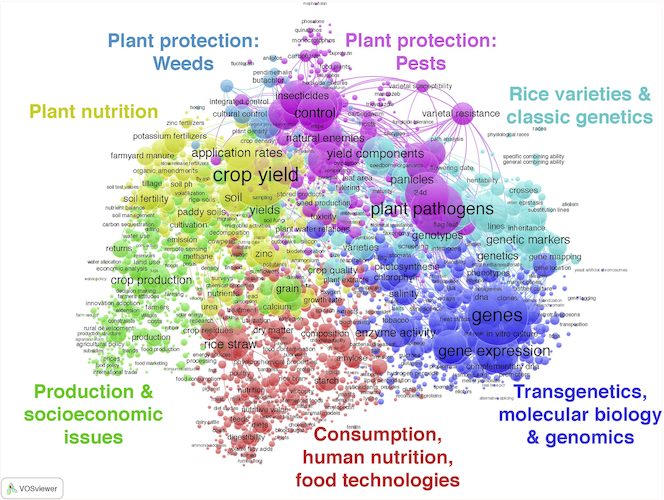
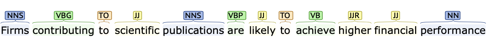

```{r setup, include=FALSE}
knitr::opts_chunk$set(echo = FALSE)
```


<!------------------------------------------>
<!-- Outline ------------------------------->
<!------------------------------------------>
# Outline

## Outline
- Defining text mining
- Text mining first steps
- Tokenisation
- Lemmatisation
- Stemming
- tf-idf


<!------------------------------------------>
<!-- Defining text mining ------------------>
<!------------------------------------------>

# Defining text mining

## What is text mining? 
*"[...] text mining seeks to extract useful information from data sources through the* **identification and exploration of interesting patterns** *[...]"*

*"[...] data sources are document collections, and interesting patterns are found not among* **formalized database records but in the unstructured textual data** *in the documents in these collections"* <font size="3">[@Feldman2006]</font>

<br></br>

*"Text mining represents the ability to take large amounts of* **unstructured language** *and quickly extract useful and novel insights that can affect* **stakeholder decision‐making***"* <font size="3">[@Kwartler2017]</font>

## Why text mining?
* **Increasing access** to data in the form of text
  + Newspapers
  + Bibliometric data (full text of publications and patents)
  + Social media (e.g. Twitter)
  + Parliamentary debates (e.g. https://hansard.parliament.uk)
  + ...
* A phenomenon of considerable **magnitude**\
  (https://www.webfx.com/internet-real-time/)
* Textual data are **unstructured**

<center>
<span style="color:orange">**How can we identify patterns in these large amount of unstructured data?**</span>
</center>

## Example 1 {.flexbox .vcenter}


<font size="3">Source: Examining linguistic and cultural phenomena (1800-2000) - sample of 5 millions books [@Michel2011]</font>


## Example 2 {.flexbox .vcenter}


<font size="3">Source: A sample of 150 year of articles published in British periodicals [@Lansdall-Welfare2017]</font>


## Example 3 {.flexbox .vcenter}
{width=90%}

<font size="3">Source: Research priorities and societal demand[@Ciarli2019]</font>


## Example 4 {.flexbox .vcenter}


<font size="3">Source: Convergence of industries using 2  million newspaper articles from 1989 to 2012 (IC = Industry convergence index, which is based on co-occurrence of industry in a sentence) [@Kim2015a]</font>


## Example 5 {.flexbox .vcenter}
<center>
{width=45%}
</center>

<font size="3">Source: Emergence of mass production in the text of Scientific American (1845-1995) [@Bone2020]</font>


## Types of text mining
* **Bag of words**
  + Words or groups of words are considered to be a feature of documents
  + The  <span style="color:red">order of words and the grammar</span> are not considered
  +  <span style="color:green">Computationally inexpensive</span> and data ready for machine learning (Document-Term Matrices)

<p></p>
  
* **Syntactic parsing**
  + Syntactic rules used to build the sentence are defined
  + Words or groups of words are tagged (e.g. adjectives, nouns, verbs)
  + <span style="color:red">Computationally expensive</span> and complex language-dependent models</span>
  + <span style="color:green"> In-depth analysis</span> of the relationships between the elements of a corpus


<!------------------------------------------>
<!-- Text mining first steps --------------->
<!------------------------------------------>

# Text mining first steps 


## The `tidytext` package in R {.flexbox .vcenter}


<font size="3">Source: https://www.tidytextmining.com</font>


## How can we "tidy" unstructured data?

<center>
{width=45%}

<font size="3">Source: The Guardian, 12 November 2021</font>

</center>


## How can we "tidy" unstructured data?

<div class="blue">
*"On Friday, youth campaigners, indigenous leaders and Extinction Rebellion members raised a cacophony of chants and drum beats outside Cop26, as civil society groups inside the conference complex staged a walkout to join them. Within the UN-controlled blue zone, delegates darted through the endless meeting halls, or hunched around laptops, as the clock counted down tense minutes to the end of the 12-day conference that is widely understood to be crucial to the future of humanity. The deals already reached The ragged final hours of Cop26 are a distinct contrast to the carefully choreographed first days, when world leaders arrived with bustling entourages to deliver a flourish of eye-catching pledges and, in the case of Boris Johnson, eye-watering metaphors, as the host nation’s prime minster proffered a string of clumsy analogies, likening the climate crisis to a football game and then a James Bond movie in his welcome address...."*
</div>

<font size="3">Source: The Guardian, 12 November 2021</font>


## Tidy data
@Wickham2017 describe tidy data as data were

* **Observations** are in rows
* **Variables** are in columns
* Each **value** is in a cell

<center>

</center>

<center><font size="3">Source: @Wickham2017</font></center>


## An overview of the process {.flexbox .vcenter}
<center>
{width=100%}
</center>

<center>
<font size="3">Source: @Silge2017</font>
</center>


## Preprocessing tasks {.flexbox .vcenter}
<center>
{width=100%}
</center>

<center>
<font size="3">Source: @Feldman2006</font>
</center>


## Preparatory processing {.flexbox .vcenter}
<center>
{width=100%}
</center>

<center>
<font size="3">Source: @Feldman2006</font>
</center>


## Preparatory processing
* Text data may be in formats that are not ready for text mining
* These include:
  - PDF files
  - XML files
  - scanned images 
  - recorded audio (e.g. speeches)
  - www
  - handwritten text
  - ...


## Preparatory processing
<center>
{width=30%}
</center>

<center>
<font size="3">Source: Scientific American, December 1851</font>
</center>


## Preparatory processing
* A key preparatory task is **perceptual grouping**
* The aim is to group the primitive elements of the documents into objects of higher levels, i.e. to generate an **O-Tree**
* For example, some OCR software packages can recognise objects such as columns from scanned images

<center>
{width=30%}
</center>

<center>
<font size="3">Source: O-Tree [@Feldman2006]</font>
</center>


## Natural Language Processing (NLP) {.flexbox .vcenter}
<center>
{width=100%}
</center>

<center>
<font size="3">Source: @Feldman2006</font>
</center>

## Natural Language Processing (NLP)
* Natural Language Processing (NLP) is an important area of an interdisciplinary research domain called **computational linguistic** 
* NLP provides techniques to **transform and process text data**, so to identify patterns in these data
* NLP is particulalrly important for **"syntactic parsing"** than for "bag of words" text mining
* Three main approaches:
  1. Part-of-Speech (POS) tagging
  2. Full parsing
  3. Shallow parsing


## Natural Language Processing (NLP)
**Part-of-Speech (POS) tagging**

* Words are categorised according to the role they play in the sentence: article, noun, verb, adjective, preposition, number, proper noun, etc.
* List of  [POS tags](https://www.ling.upenn.edu/courses/Fall_2003/ling001/penn_treebank_pos.html)
* The tokenisation of text into words or groups of words (*we will see this in practice later*)

<center>
{width=100%}
</center>

<center>
<font size="3">Source: https://corenlp.run</font>
</center>


## Natural Language Processing (NLP)
**Full parsing**

* The objective is to perform a full syntactical analysis of sentence identifying two elements

  + **Constituency grammars**: short phases that convey a meaning
    + **Noun phrase (NP)**: subjects or objects to a verb
    + **Verb phrase (VP)**: verbs
    + **Adjective phrase (ADJP)**: adjectives to qualify nouns and pronouns
    + **Adverb phrase (ADVP)**: adverbs to modify nouns, verbs, or adverbs
    + **Prepositional phrase (PP)**: prepositions to describe words or phrases
    
  + **Dependency grammars**: relationships between words (e.g. a subject and an object depend on a verb)

## Natural Language Processing (NLP) {.flexbox .vcenter}
**Constituency grammars**

<center>
{width=100%}
</center>

<center>
<font size="3">Source: https://corenlp.run</font>
</center>


## Natural Language Processing (NLP) {.flexbox .vcenter}
**Dependency grammars**

<center>
{width=100%}
</center>

<center>
<font size="3">Source: https://corenlp.run</font>
</center>


## Natural Language Processing (NLP)
**Shallow parsing**

* Performing a full parsing for large text corpora could be **computationally expensive**
* Shallow parsing reduces the **depth** of the parsing analysis for the sake of **speed**
  + **Simple and short phrases are** identified
  + **Unclear and ambiguous dependency** are left unresolved
* The results of the shallow parsing are sufficient to characterise a corpus


## Problem dependent processing {.flexbox .vcenter}
<center>
{width=100%}
</center>

<center>
<font size="3">Source: @Feldman2006</font>
</center>

## Problem dependent processing
* **Text categorization or classification**
  + Assigning **tags** representing concepts or keywords to documents 
  + Tags may have a **hierarchical structure**
  + Examples: [Medical Subject Headings](https://www.nlm.nih.gov/mesh/meshhome.html), [JEL Classification System](https://www.aeaweb.org/econlit/jelCodes.php?view=jel)

<p></p>

* **Information extraction** 
  + Extracting information and presenting this in a **structured format** (e.g. tables, charts), beyond the simple information retrieval (e.g. identification of keywords in text) 
  + **Entity extraction**: entities in the text (e.g. individuals)
  + **Relation extraction**: relationships between entities as in the text
  + **Coreference resolution**: expressions referring to the same entity (e.g. Daniel, him, his)


## Our focus
* We will focus on text mining based on **bags of words**
* Techniques to **process** and **analyse** the text
  + Tokenisation
  + Lemmatisation
  + Stemming
  + tf-idf
  + Visualisation
  + Sentiment analysis
  + Topic modelling


<!------------------------------------------>
<!-- Tokenisation -------------------------->
<!------------------------------------------>
# Tokenisation


## What is tokenisation?
* The objective is to break text into **meaningful elements**
* For example, we can break a document into
  + chapters
  + sections
  + paragraphs
  + sentences
  + words
  + syllables


## What is tokenisation?
* A commonly used approach is to break the text into words, i.e. **tokens**
* A token could be 
  + a single word (unigram)
  + two subsequent words (i.e. bigram)
  + ...
  + n subsequent words (n-gram)
* We can use token to build a **tidy dataset**, where each row reports a **token**


## Tokenisation in `tidytext`
* In `tidytext`, the function `unnest_tokens` enables us to tokenise the text
* This function
  + removes punctuation 
  + converts tokens into lower case
* For more options see `??unnest_tokens`


## Example: (1) Data on news articles
* Text from 692 news English articles on COP26 published by newspapers on 12 November 2021

<center>
{width=60%}
</center>

<center>
<font size="3">Source: Nexis database (available at the University of Sussex Library)</font>
</center>


## Example: (2) Data on news articles
* Each news article has a numeric id
* Text is include in the fields
  + "Title"
  + "Headline"
  + "Hlead"

<center>
{width=60%}
</center>


## Example: (3) Reading the data
* We  load the `readr`, `tidyverse`, `tidytext`, and `ggplot` packages
* We store our data into R as a dataframe/tibble
* We focus on the text reported in the field "Title"
```{r, echo = TRUE, message = FALSE}
library(readr)
library(ggplot2)
library(tidyverse)
library(tidytext)

my_text <- read_csv("news_articles_example.csv") %>%
  select(id, Title)
```

## Example: (3) Reading the data
```{r, echo = TRUE, message = FALSE}
print(my_text, n = 6)
```


## Example: (4) Tokenisation (unigrams)
We tokenise each sentence into unigrams
```{r, echo = TRUE, message = FALSE}
my_text_uni <- my_text %>%
  unnest_tokens(output = word, input = Title)

print(my_text_uni, n = 6)
```


## Example: (4) Tokenisation (bigrams)
We could also tokenise into n-grams, for example bigrams
```{r, echo = TRUE, message = FALSE}
my_text_bi <- my_text %>%
  unnest_tokens(output = bigram, input = Title, 
                token = "ngrams", n = 2)

print(my_text_bi, n = 6)
```


## Example: (4) Tokenisation (trigrams)
... or trigrams
```{r, echo = TRUE, message = FALSE}
my_text_tri <- my_text %>%
  unnest_tokens(output = trigram, input = Title, 
                token = "ngrams", n = 3)

print(my_text_tri, n = 6)
```


## Example: (4) Tokenisation (characters)
... or sequences of characters (five in the case below)
```{r, echo = TRUE, message = FALSE}
my_text_char <- my_text %>%
  unnest_tokens(output = character_shingles, input = Title,  
                token = "character_shingles", n = 5)

print(my_text_char, n = 6)
```


## Example: (5) POS tagging
```{r, echo = TRUE, message = FALSE}
my_text_uni_pos <- my_text_uni %>%
  left_join(parts_of_speech, by  = "word")

print(my_text_uni_pos, n = 6)
```


## Example: (5) POS tagging
```{r, echo = TRUE, message = FALSE}
my_text_uni_pos <- my_text_uni_pos %>%
  group_by(pos) %>%
  count(pos, sort = T)

print(my_text_uni_pos, n = 6)
```


## Example: (5) POS tagging
```{r, echo = FALSE, message = FALSE}
DT::datatable(my_text_uni_pos, 
              rownames = F,
              filter = "top",
              class = "hover", 
              options = list(pageLength = 5))
```


## Example: (6) Counting words
Let's focus on unigrams and count the number of words
```{r, echo = TRUE, message = FALSE}
my_text_uni_count <- my_text_uni %>% 
  count(word, sort = T)

print(my_text_uni_count, n = 6)
```


## Example: (6) Counting words
```{r, echo = FALSE, message = FALSE}
DT::datatable(my_text_uni_count, 
              rownames = F,
              filter = "top",
              class = "hover", 
              options = list(pageLength = 5))
```


## Example: (6) Counting words
Basic descriptive statistics
```{r, echo = TRUE, message = FALSE}
summarise(my_text_uni_count, 
          num_words = n(),
          mean = mean(n),
          sd   = sd(n),
          min  = min(n),
          max  = max(n))
```
 
  
## Example: (6) Counting words
We can plot the most frequent words representing the 1% of the total sample
```{r, echo = TRUE, message = FALSE}
min_occur <- quantile(my_text_uni_count$n, 0.99)

g <- my_text_uni_count %>%
  filter(n >= min_occur) %>%
  mutate(word = reorder(word, n)) %>% 
  ggplot(aes(x = word, y = n, fill = word)) +
  geom_col() +
  theme(legend.position = "none") +
  coord_flip()
```


## Example: (6) Counting words
* Many words are not particularly relevant (e.g. to, the, in) 
* These terms are called stopwords

<center>
```{r, echo = FALSE, message = FALSE, }
library(plotly)
ggplotly(g)
```
</center>


## Example: (7) Removing stopwords
```{r, echo = TRUE, message = FALSE}
data(stop_words)

my_text_uni <- my_text_uni %>%
      anti_join(stop_words)

my_text_uni_count <- my_text_uni %>% 
  count(word, sort = T)

g <- my_text_uni_count %>%
  filter(n >= min_occur) %>%
  mutate(word = reorder(word, n)) %>% 
  ggplot(aes(x = word, y = n, fill = word)) +
  geom_col() +
  theme(legend.position = "none") +
  coord_flip()
```


## Example: (7) Removing stopwords
<center>
```{r, echo = FALSE, message = FALSE}
ggplotly(g)
```
</center>

## Example: (8) Removing numbers
* Numbers my not be meaningful for your analysis
* We can remove numbers converting text into numeric format
```{r, echo = TRUE, message = FALSE}
my_text_uni <- my_text_uni %>%
    mutate(word_numeric = as.numeric(word))
```


## Example: (8) Removing numbers
```{r, echo = FALSE, message = FALSE}
DT::datatable(my_text_uni, 
              rownames = F,
              filter = "top",
              class = "hover", 
              options = list(pageLength = 5))
```


## Example: (8) Removing numbers
* `NAs` in the table are word, so we can filter those only
* We can reduce the threshold to the most frequnet words representing the 2% of the total sample so to explore more words

```{r, echo = TRUE, message = FALSE}
my_text_uni <- my_text_uni %>%
  filter(is.na(word_numeric))

my_text_uni_count <- my_text_uni %>% 
  count(word, sort = T)

min_occur <- quantile(my_text_uni_count$n, 0.98)

g <- my_text_uni_count %>%
  filter(n >= min_occur) %>%
  mutate(word = reorder(word, n)) %>% 
  ggplot(aes(x = word, y = n, fill = word)) +
  geom_col() +
  theme(legend.position = "none") +
  coord_flip()
```


## Example: (8) Removing numbers
<center>
```{r, echo = FALSE, message = FALSE, fig.height = 9, fig.width = 9, fig.align = "center"}
ggplotly(g)
```
</center>


## Example: (9) Additional stopwords
* In some case, you may want to remove words that are not particularly relevant

```{r, echo = TRUE, message = FALSE}
my_stop_words <- tibble(word = c("cop26", "final", "news"), 
                        lexicon = "mywords")

my_text_uni<- my_text_uni %>%
      anti_join(my_stop_words)

g <- my_text_uni %>% 
  count(word, sort = T) %>%
  filter(n >= min_occur) %>%
  mutate(word = reorder(word, n)) %>% 
  ggplot(aes(x = word, y = n, fill = word)) +
  geom_col() +
  theme(legend.position = "none") +
  coord_flip()
```


## Example: (9) Additional stopwords
<center>
```{r, echo = FALSE, message = FALSE, fig.height = 9, fig.width = 9, fig.align = "center"}
ggplotly(g)
```
</center>

## Tokenised data
* [Google Books](http://storage.googleapis.com/books/ngrams/books/datasetsv2.html) provides access to tokenised data for several millions of books
* Data structure
  + token (n-gram)
  + number of occurrences (match_count)
  + number of occurrences in distinct books (volume_count)
* **Warning:** The database includes a large amount of data (several gigabytes)
* Google Books [query interface](https://books.google.com/ngrams)
* We can use the `ngramr` package to gather data 

## Example: (10) Google Books
```{r, echo = TRUE, message = FALSE}
library(ngramr)
library(ggplot2)
googlebook_data  <- ngram(c("science", "technology", "innovation"), 
             smoothing = 0, year_start = 1900)
g <- ggplot(googlebook_data, 
       aes(x = Year, y = Frequency, colour=  Phrase)) +
  geom_line()
```

## Example: (10) Google Books
<center>
```{r, echo = FALSE, message = FALSE}
ggplotly(g)
```
</center>


<!------------------------------------------>
<!-- Lemmatisation ------------------------->
<!------------------------------------------>
# Lemmatisation

## What is lemmatisation?
* Individual tokens are reduced to their base form, called "lemma"
  + "am", "are", "is" --> "be"
  + "cars" --> "car"
  + "arrived" --> "arrive"
  + ...
* **Lemmatisation** normalise text (e.g. counting)
* This processing is useful for **sentiment analysis**


## Example: (1) Unigrams lemmatisation 
* We can use the package `textstem`
* We have already remove stopwords, numbers, and additional stopwords from the list of unigrams
```{r, echo = TRUE, message = FALSE}
library(textstem)
my_text_uni <- my_text_uni %>%
  mutate(word_lemma = textstem::lemmatize_words(word))
```

## Example: (1) Unigrams lemmatisation 
```{r, echo = FALSE, message = FALSE}
DT::datatable(my_text_uni, 
              rownames = F,
              filter = "top",
              class = "hover", 
              options = list(pageLength = 5))
```

## Example: (2) Counting lemmas 
* We can now count lemmas and plot the results
```{r, echo = TRUE, message = FALSE}
my_text_uni_count <- my_text_uni %>% 
  count(word_lemma, sort = T)

min_occur <- quantile(my_text_uni_count$n, 0.95)

g <- my_text_uni_count %>%
  filter(n >= min_occur) %>%
  mutate(word_lemma = reorder(word_lemma, n)) %>% 
  ggplot(aes(x = word_lemma, y = n, fill = word_lemma)) +
  geom_col() +
  theme(legend.position = "none") +
  coord_flip()
```


## Example: (2) Counting lemmas 
<center>
```{r, echo = FALSE, message = FALSE, fig.height = 9, fig.width = 9, fig.align = "center"}
ggplotly(g)
```
</center>


<!------------------------------------------>
<!-- Stemming ------------------------------>
<!------------------------------------------>
# Stemming


## What is stemming?
* Stemming is similar to the lemmatisations
* It removes the suffix of a word
  + "playing" --> "play"
  + "consultant" --> "consult"
  + "magically" --> "magic"
  + ...


## Example: (1) Stemming unigrams
* We can use the package `SnowballC`
* We have already removed stopwords, numbers, and additional stopwords from the list of unigrams
```{r, echo = TRUE, message = FALSE}
library(SnowballC)
my_text_uni <- my_text_uni %>%
  mutate(word_stem = wordStem(word))
```


## Example: (1) Stemming unigrams
```{r, echo = FALSE, message = FALSE}
DT::datatable(my_text_uni, 
              rownames = F,
              filter = "top",
              class = "hover", 
              options = list(pageLength = 5))
```


## Example: (2) Counting stems 
* We can now count words/stems and plot the results
```{r, echo = TRUE, message = FALSE}
my_text_uni_count <- my_text_uni %>% 
  count(word_stem, sort = T)

min_occur <- quantile(my_text_uni_count$n, 0.95)

g <- my_text_uni_count %>%
  filter(n >= min_occur) %>%
  mutate(word_stem = reorder(word_stem, n)) %>% 
  ggplot(aes(x = word_stem, y = n, fill = word_stem)) +
  geom_col() +
  theme(legend.position = "none") +
  coord_flip()
```


## Example: (2) Counting stems
<center>
```{r, echo = FALSE, message = FALSE, fig.height = 9, fig.width = 9, fig.align = "center"}
ggplotly(g)
```
</center>


<!------------------------------------------>
<!-- TF-IDF -------------------------------->
<!------------------------------------------>
# tf-idf


## tf-idf
* Term frequency provides an indication of the most frequent words in a corpus
* Some words may be not very frequent in a corpus, but they may be particular for some documents in the corpus
* We can identify these words using the **term frequency-inverse document frequency** indicator

<center>
$\text{tf-idf}_{i,d} = \text{tf}_{i,d}*\text{idf}_{i}$
</center>

<br></br>

<center>
$\text{tf-idf}_{i,d} = \frac{\text{n of times term } i \text{ appears in document }d}{\text{n of terms in the document } d} * ln\left(\frac{\text{n of documents}}{\text{n of documents containing the term } i}\right)$
</center>


## Example: (1) Tokenisation, stopwords, numbers
* We use the lead paragraph ("Hlead"), we tokenize data into unigram, we remove stopwords and numbers
* Our corpus include 242,831 id-unigram pairs
```{r, echo = TRUE, message = FALSE}
my_text_uni<- read_csv("news_articles_example.csv") %>%
  select(id, Hlead) %>%
  unnest_tokens(output = word, input = Hlead) %>%
  anti_join(stop_words) %>%
  mutate(word_numeric = as.numeric(word)) %>%
  filter(is.na(word_numeric)) %>%
  select(-word_numeric)
```

## Example: (2) term frequency (tf)
We can calculate the tf (term frequency by document)
```{r, echo = TRUE, message = FALSE}
article_words <- my_text_uni %>%
  count(id, word, sort = T) %>% 
  ungroup()

head(article_words)
```


## Example: (3) term frequency (tf)
```{r, echo = TRUE, message = FALSE}
total_words <- article_words %>%
      group_by(id) %>%
      summarize(total = sum(n))

print(total_words, n = 6)
```


## Example: (4) term frequency (tf)
We remove document with only a single word
```{r, echo = TRUE, message = FALSE}
article_words <- left_join(article_words, total_words) %>%
  filter(total > 1) %>%
  mutate(word_freq = n/total)

print(article_words, n = 6)
```


## Example: (5) term frequency (tf)
Let's look at the term frequency distribution of three random articles
```{r, echo = TRUE, message = FALSE}
g <-  article_words %>%
  filter(id == 107 | id == 175 | id == 288 | id == 631)  %>%
  ggplot(aes(word_freq, fill = as.character(id))) + 
  geom_histogram() + 
  xlim(NA, 0.05) +
  theme(legend.position = "none") +
  facet_wrap(~id, ncol = 4)
```


## Example: (6) term frequency (tf) {.flexbox .vcenter}
```{r, echo = FALSE, message = FALSE, fig.width=10, fig.height=4}
ggplotly(g)
```


## Example: (7) tf-idf
* Some words are very frequent in a number of documents (articles in this case)
* tf-idf helps us to identify words that are able to characterize documents
* In `tidytext` the function `bind_tf_idf` calculate the tf-idf scores starting from a tidy text dataset: one row per token per document including the information about term frequency
* Check the help guide `??bind_tf_idf`


## Example: (8) tf-idf
Let's start from reading the data again
```{r, echo = TRUE, message = FALSE}
article_words_tfidf <- read_csv("news_articles_example.csv") %>%
  select(id, Hlead) %>%
  unnest_tokens(output = word, input = Hlead) %>%
  anti_join(stop_words) %>%
  mutate(word_numeric = as.numeric(word)) %>%
  filter(is.na(word_numeric)) %>%
  select(-word_numeric) %>%
  count(id, word, sort = T) %>% 
  ungroup() %>%
  bind_tf_idf(word, id, n) 
```


## Example: (9) tf-idf
```{r, echo = TRUE, message = FALSE}
print(article_words_tfidf, n = 6)
```


## Example: (10) tf-idf
Let's look at top 15 words by tf-idf in the case of four random articles
```{r echo=TRUE, message=FALSE}
g <- article_words_tfidf %>%
  filter(id == 107 | id == 175 | id == 288 | id == 631)  %>%
  group_by(id) %>%
  top_n(15, tf_idf) %>%
  ungroup %>%
  mutate(id = as.factor(id),
         word = reorder_within(word, tf_idf, id)) %>%
  ggplot(aes(word, tf_idf, fill = id)) +
  geom_col() +
  facet_wrap(~id,  nrow = 2, scales = "free_y") +
  coord_flip() +
  theme(legend.position = "none") +
  scale_x_reordered()
```


## Example: (11) tf-idf {.flexbox .vcenter}
```{r, echo = FALSE, message = FALSE, fig.width=9, fig.height=5.75}
ggplotly(g)
```


## Example: (12) tf-idf (bigrams)
* In the case of bigrams, to remove stopwords you need first to `separate()`, filter stop words, and then `unite()` bigrams again
* Similarly in the case of n-grams

```{r, echo = TRUE, message = FALSE}
article_words_tfidf <- read_csv("news_articles_example.csv") %>%
  select(id, Hlead) %>%
  unnest_tokens(output = bigram, input = Hlead, 
                token = "ngrams", n = 2) %>%
  separate(bigram, c("word_1", "word_2"), sep = " ") %>%
  filter(!word_1 %in% stop_words$word) %>%
  filter(!word_2 %in% stop_words$word) %>%
  unite(bigram, word_1, word_2, sep = " ") %>%
  count(id, bigram, sort = T) %>% 
  bind_tf_idf(bigram, id, n) 
```


## Example: (13) tf-idf (bigrams)
```{r, echo = TRUE, message = FALSE}
print(article_words_tfidf, n = 6)
```


## Example: (14) tf-idf (bigrams)
Let's look at top 15 bigrams by tf-idf in the case of four random articles
```{r echo=TRUE, message=FALSE}
g <- article_words_tfidf %>%
  filter(id == 107 | id == 175 | id == 288 | id == 631) %>%
  group_by(id) %>%
  top_n(5, tf_idf) %>%
  ungroup %>%
  mutate(id = as.factor(id),
         bigram = reorder_within(bigram, tf_idf, id)) %>%
  ggplot(aes(bigram, tf_idf, fill = id)) +
  geom_col() +
  facet_wrap(~id,  nrow = 2, scales = "free_y") +
  coord_flip() +
  theme(legend.position = "none") +
  scale_x_reordered()
```


## Example: (15) tf-idf (bigrams) {.flexbox .vcenter}
```{r, echo = FALSE, message = FALSE, fig.width=9, fig.height=5.75}
ggplotly(g)
```


<!------------------------------------------>
<!-- Questions ---------------------------->
<!------------------------------------------>
# Questions


<!------------------------------------------>
<!-- Computer session ---------------------->
<!------------------------------------------>
# Computer session


## Plan
1. Students are grouped in  randomly generated groups
2. Groups will select at least one **text corpus** and develop a script in R that undertake a text mining analysis (data are available on Canvas)
3. Groups will upload the R script and the main findings in [Padlet](https://uofsussex.padlet.org/d_rotolo/qc5zbnwof56oa1fn)  by the end of Week 9 workshop


## Groups

**Group 1**\
Adebisi, Jongho, Maria, Keiho

**Group 2**\
Charunan, Poojani, Abdul, Satoshi

**Group 3**\
Oscar, Tsukumo, Jiyoung, Nicholas

**Group 4**\
Alessandro, Shaunna, Jonathan, Rachel


<!------------------------------------------>
<!-- Next time ---------------------------->
<!------------------------------------------>
# Next time

## Next time
* Visualising text data
* Sentiment analysis
* Regular expressions
* Introduction to topic modelling


<!------------------------------------------>
<!-- References ---------------------------->
<!------------------------------------------>
# References

## References{.smaller}
<style>
slides > slide { overflow: scroll; }
slides > slide:not(.nobackground):after {
  content: '';
}
</style>