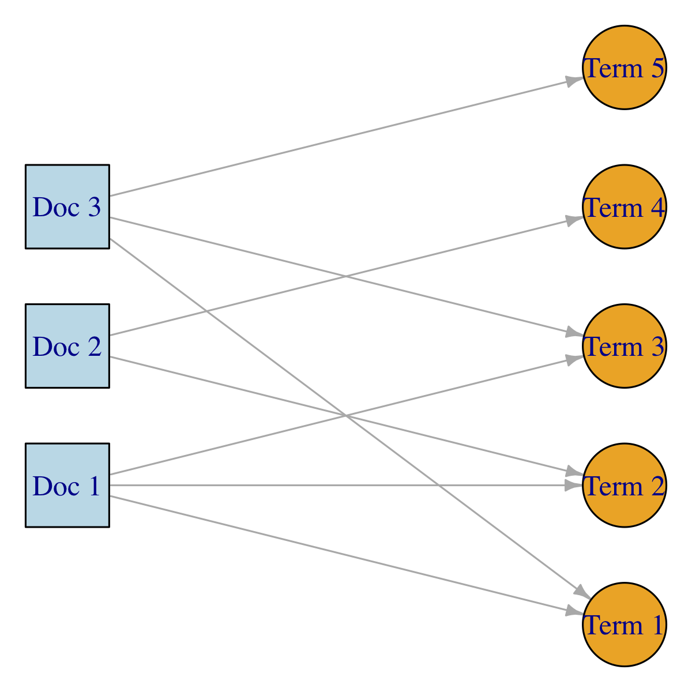

```{r setup, include=FALSE}
knitr::opts_chunk$set(echo = FALSE)
```


<!------------------------------------------>
<!-- Outline ------------------------------->
<!------------------------------------------>
# Outline

## Outline
* Visualising text data
* Sentiment analysis
* Regular expressions
* Introduction to topic modelling


<!------------------------------------------>
<!-- Visualising text data ----------------->
<!------------------------------------------>
# Visualising text data


## Visualising text data
* So far, we explored text mining counting words and visualising their frequency using bar charts or similar
* **Bag of words** approach, 
  + We do not consider the order of words
  + Yet, we can account for words occurring in the same sentence, paragraph, article, or, more generally, document
* This analysis is called **co-word analysis** [@Callon1991]
* A network is generated
  + Nodes = words
  + Links = co-occurrence of words (**cosine similarity normalisation**)


## Co-word analysis {.flexbox .vcenter}
<div class="columns-2">
<center>
{width=70%}
</center>

<center>
{width=70%}
</center>
</div>


## Co-word analysis
<center>
{width=90%}
</center>

<center>
<font size="3">Source: Research priorities and societal demand[@Ciarli2019]</font>
</center>

## Example: (1) Co-word analysis
* We load all packages we need for co-word analysis and subsequent examples
* In particular, the `igraph` (**network analysis**) and `ggraph` (**network visualisation**) packages 

```{r echo=TRUE, message=FALSE}
library(tidyverse)
library(tidytext)
library(ggplot2)
library(plotly)
library(igraph)
library(ggraph)
```


## Example: (2) Co-word analysis
* We extract unigrams from  from 692 news English articles on COP26 published by newspapers on 12 November 2021
* We use text in titles only
* We remove stopwords and numbers
```{r, echo = TRUE, message = FALSE}
my_text_uni <- read_csv("news_articles_example.csv") %>%
  filter(Publication == "The Guardian (London)" | 
         Publication == "The New York Times" |  
          Publication == "The Independent (United Kingdom)") %>%
  select(id, Title) %>%
  unnest_tokens(output = word, input = Title) %>%
  anti_join(stop_words) %>%
  mutate(word_numeric = as.numeric(word)) %>%
  filter(is.na(word_numeric)) %>%
  select(-word_numeric)
```


## Example: (3) Co-word analysis
```{r, echo = TRUE, message = FALSE}
my_text_uni
```


## Example: (4) Co-word analysis
* We need to build a bipartite network (in this case a doc-term network)
```{r, echo = TRUE, message = FALSE}
my_text_uni <- my_text_uni %>%
  mutate(id = paste0("doc", id))

node1 <- my_text_uni %>%
  distinct(id) %>%
  rename(node = id) %>%
  mutate(type = T)

node2 <- my_text_uni %>%
  distinct(word) %>%
  rename(node = word) %>%
  mutate(type = F)

nodes <- bind_rows(node1, node2)
```


## Example: (5) Co-word analysis
```{r, echo = TRUE, message = FALSE}
nodes
```


## Example: (6) Co-word analysis
* The list of links between documents (articles) and words is in the `my_text_uni` object, while nodes are in the `nodes` object
* We can create a network relying on the function `graph_from_data_frame` from the package `igraph`
```{r, echo = TRUE, message = FALSE}
g_bip <- graph_from_data_frame(my_text_uni, vertices = nodes, directed = F)
```


## Example: (7) Co-word analysis
```{r, echo = TRUE, message = FALSE}
g_bip
```


## Example: (8) Co-word analysis
```{r, echo = TRUE, message = FALSE, fig.width=11, fig.height=7}
g_bip_vis <- ggraph(g_bip, layout = "stress") +
  geom_edge_link0(edge_colour = "grey") +
  geom_node_point(aes(shape = type, color =  type), size = 2.5) +
  theme_graph()
```


## Example: (9) Co-word analysis
```{r, echo = FALSE, message = FALSE, fig.width=10, fig.height=5}
print(g_bip_vis)
```


## Example: (10) Co-word analysis
* We can transform this network so to have a word-word network (**bipartite projection**)
* We focus on the **largest component**
* We increase the size of nodes/words on the basis of degree a word has with other words
```{r, echo = TRUE, message = FALSE}
g <- bipartite_projection(g_bip, multiplicity = T, which = F)
g <- decompose.graph(g)[[1]]
V(g)$size <- degree(g)
```


## Example: (11) Co-word analysis
```{r, echo = TRUE, message = FALSE}
g
```


## Example: (12) Co-word analysis
```{r, echo = TRUE, message = FALSE, fig.width=11, fig.height=7}
g_vis <- ggraph(g, layout = "stress") +
  geom_edge_link0(aes(edge_width = weight), edge_colour = "grey66") +
  geom_node_point(aes(size = size), fill = "lightblue", colour = "white", shape = 21) +
  geom_node_text(aes(label = name), size = 2.5) +
  scale_edge_width(range = c(0.5, 3)) +
  scale_size(range = c(1, 10)) +
  theme_graph()
```


## Example: (13) Co-word analysis
```{r, echo = FALSE, message = FALSE, fig.width=15, fig.height=10}
print(g_vis)
```


## Example: (14) Co-word analysis (cosine similarity)
* Co-occurrence only may have serious limitations (e.g. length of a document and normalisation challenges)
* **Cosine similarity** enable us to assess how "similar" are two words since they occur in same set of documents

<center>
$\text{cosine_sim} =\frac{w_1*w_2}{||w_1||*||w_2||}=\frac{\sum_{i=1}^n{w_{1,i}*w_{2,i}}}{\sqrt{\sum_{i=1}^n{w_{1,i}^2}}*\sqrt{\sum_{i=1}^n{w_{2,i}^2}}}$
</center>


## Example: (15) Co-word analysis (cosine similarity)
```{r, echo = TRUE, message = FALSE}
w1 <- c(1, 0, 0, 0, 2)
w2 <- c(1, 0, 1, 0, 1)
w3 <- c(0, 0, 3, 0, 1)
lsa::cosine(w1, w2)
lsa::cosine(w1, w3)
```


## Example: (16) Co-word analysis (cosine similarity)
* Let's calculate cosine similarity for our unigrams
```{r, echo = TRUE, message = FALSE}
my_text_uni <-  my_text_uni %>%
  count(id, word) %>% 
  cast_dtm(id, word, n)

my_text_uni
```


## Example: (17) Co-word analysis (cosine similarity)
```{r, echo = TRUE, message = FALSE}
my_text_uni <- lsa::cosine(as.matrix(my_text_uni))
g_cos <- graph_from_adjacency_matrix(my_text_uni, mode = "undirected", weighted = T)
g_cos <- delete.edges(g_cos, which(E(g_cos)$weight < 0.3))
g_cos <- decompose.graph(g_cos)[[1]]
g_cos
```


## Example: (18) Co-word analysis (cosine similarity)
```{r, echo = TRUE, message = FALSE}
g_vis <- ggraph(g_cos, layout = "stress") +
  geom_edge_link0(aes(edge_width = weight), edge_colour = "grey66") +
  geom_node_point(fill = "lightblue", colour = "white", shape = 21) +
  geom_node_text(aes(label = name), size = 2.5) +
  scale_edge_width(range = c(0.01, 0.1)) +
  scale_size(range = c(1, 10)) +
  theme_graph()
```


## Example: (19) Co-word analysis (cosine similarity)
```{r, echo = FALSE, message = FALSE, fig.width=15, fig.height=10}
print(g_vis)
```


## Additional tools for co-word analysis
* [Gephi](https://gephi.org/): Export the network data as a "gml" file (see function `write_gml`) to read it in Gephi
* [VOSViewer](https://www.vosviewer.com/): Focussed on publication data
* [VantagePoint](https://www.thevantagepoint.com/): Focussed on publication and patent data


<!------------------------------------------>
<!-- Sentiment analysis -------------------->
<!------------------------------------------>
# Sentiment analysis


## Sentiment analysis
* Sentiment analysis aims to extract **emotional intentions** from documents (e.g. happiness, surprise, negative/positive feelings)
* It builds on linguistic, psychology, and NLP
* A simple approach to classify documents is to rely on **subjectivity lexicons**
* The `tidtext` package includes several lexicons, which are based on **classification of unigrams**
  + Bing
  + AFIN
  + NRC


## Subjectivity lexicons: Bing
* We are often just interested in understanding the **polarity of a document**
* The Bing lexicon classifies unigrams as **positive** or **negative**
```{r echo=TRUE, message=FALSE}
get_sentiments("bing")
```


## Subjectivity lexicons: AFINN
* The AFINN lexicon goes beyond the binary classification of the Bing lexicon
* It assigns a score from -5 (**negative**) to +5 (**positive**) to each unigram
```{r echo=TRUE, message=FALSE}
get_sentiments("afinn")
```


## Subjectivity lexicons: NRC
<div class="columns-2">
* Plutchik’s primary emotions
  + anger
  + anticipation
  + joy
  + trust
  + fear
  + surprise
  + sadness
  + disgust
* All emotions can be derived from the primary ones


<center>
{width=80%}
</center>
<center>
<font size="3">Source: Plutchik’s wheel of emotion with eight primary emotional states [@Kwartler2017]</font>
</center>

</div>


## Subjectivity lexicons: NRC
```{r echo=TRUE, message=FALSE}
get_sentiments("nrc")
```


## Other subjectivity lexicons
* [SentiWords](https://hlt-nlp.fbk.eu/technologies/sentiwords): 155,000 English words with a sentiment score from -1 to +1
* [WordStat](https://provalisresearch.com/products/content-analysis-software/wordstat-dictionary/sentiment-dictionaries/): a negative sentiment is measured on the basis of two rules
  + Negative words that are not preceded by a negation (no, not never) within four words in the same sentence
  + Positive words that are preceded by a negation within four words in the same sentence
  + Similarly in the case of positive sentiments
* [Pattern](https://www.clips.uantwerpen.be/pages/pattern-en#sentiment): 2,888 words are scored according to four indicators polarity, subjectivity, intensity and reliability
* [SENTIMENT140](https://github.com/felipebravom/StaticTwitterSent/tree/master/extra/Sentiment140-Lexicon-v0.1): unigrams, bigrams, and pairs (unigrams-bigrams; bigrams-unigrams; bigrams-bigramns) classified with negative and postivie sentiments on the basis of 1.6 million tweets
* ...


## Example: (1) Tokenisation, stopwords, numbers
* Text from 692 news English articles on COP26 published by newspapers on 12 November 2021
* We use the all text field (Title, Headline, Hlead)
* We tokenize data into unigram and remove stopwords as well as numbers

```{r, echo = TRUE, message = FALSE}
my_text_uni <- read_csv("news_articles_example.csv") %>%
  mutate(all_text = paste(Title, Headline, Hlead, sep = " ")) %>%
  select(id, all_text) %>%
  unnest_tokens(output = word, input = all_text) %>%
  anti_join(stop_words) %>%
  mutate(word_numeric = as.numeric(word)) %>%
  filter(is.na(word_numeric)) %>%
  select(-word_numeric)
```


## Example: (2) Tokenisation, stopwords, numbers
* Our corpus include 191,069 id-unigram pairs
```{r, echo = TRUE, message = FALSE}
print(my_text_uni, n = 6)
```

## Example: (3) Bing lexicon
* 18,108 id-unigram pairs are classified with the Bing lexicon
```{r, echo = TRUE, message = FALSE}
my_text_uni_bing <- my_text_uni %>%
  inner_join(get_sentiments("bing"))

print(my_text_uni_bing, n = 6)
```


## Example: (4) Bing lexicon
```{r, echo = TRUE, message = FALSE}
my_text_uni_bing_by_id <- my_text_uni_bing %>%
  count(id, sentiment) %>%
  pivot_wider(names_from = sentiment, values_from = n, values_fill = list(n = 0))

print(my_text_uni_bing_by_id, n = 6)
```


## Example: (5) Bing lexicon
```{r, echo = TRUE, message = FALSE}
 g <- my_text_uni_bing_by_id %>%
  ggplot(aes(id)) + 
  geom_bar(aes(y =  positive), stat = "identity", show.legend = FALSE, fill = "blue") +
  geom_bar(aes(y = -negative), stat = "identity", show.legend = FALSE, fill = "red") +
  scale_y_continuous(limits = c(-180, +180)) +
  xlab(label = "Document ID") +
  ylab(label =  "Number of positive and negative words") +
  geom_hline(yintercept = 0, color = "black", size = 0.2)
```


## Example: (6) Bing lexicon {.flexbox .vcenter}
```{r, echo = FALSE, message = FALSE, fig.width=9, fig.height=5}
ggplotly(g)
```


## Example: (7) Bing lexicon
* We can identify the top-15 positive and negative words
```{r, echo = TRUE, message = FALSE}
my_text_uni_bing_by_count <- my_text_uni_bing %>%
  count(word, sentiment) %>%
  ungroup()

print(my_text_uni_bing_by_count, n = 6)
```


## Example: (8) Bing lexicon
```{r, echo = TRUE, message = FALSE}
g <- my_text_uni_bing_by_count %>%
  group_by(sentiment) %>%
  top_n(15, n) %>%
  ungroup %>%
  mutate(sentiment = as.factor(sentiment),
         word = reorder_within(word, n, sentiment)) %>%
  ggplot(aes(word, n, fill = sentiment)) +
  geom_col() +
  facet_wrap(~sentiment,  nrow = 1, scales = "free_y") +
  coord_flip() +
  theme(legend.position = "none") +
  scale_x_reordered()
```


## Example: (9) Bing lexicon
```{r, echo = FALSE, message = FALSE, fig.width=10, fig.height=4}
ggplotly(g)
```


## Example: (10) AFINN lexicon
* 18,823 id-unigram pairs are classified with the AFINN lexicon
```{r, echo = TRUE, message = FALSE}
my_text_uni_afinn <- my_text_uni %>%
  inner_join(get_sentiments("afinn"))

print(my_text_uni_afinn, n = 6)
```


## Example: (11) AFINN lexicon
* We can calculate a "total sentiment" for a given article/document
```{r, echo = TRUE, message = FALSE}
my_text_uni_afinn_by_id <- my_text_uni_afinn %>%
  group_by(id) %>%
  summarise(sentiment = sum(value)) %>%
  mutate(overall_sentiment = case_when(
    sentiment >  0 ~ "positive",
    sentiment <  0 ~ "negative",
    sentiment == 0 ~ "neutral"))
```


## Example: (12) AFINN lexicon
```{r, echo = TRUE, message = FALSE}
print(my_text_uni_afinn_by_id, n = 6)
```


## Example: (13) AFINN lexicon
```{r, echo = TRUE, message = FALSE}
 g <- my_text_uni_afinn_by_id %>%
  ggplot(aes(x = id, y = sentiment, fill = overall_sentiment)) + 
  geom_bar(stat = "identity") +
  scale_y_continuous(limits = c(-250, +250)) +
  xlab(label = "Document ID") +
  ylab(label =  "Sentiment score") +
  geom_hline(yintercept = 0, color = "black", size = 0.2) +
  theme(legend.position = "bottom")
```


## Example: (14) AFINN lexicon {.flexbox .vcenter}
```{r, echo = FALSE, message = FALSE, fig.width=10, fig.height=5.5}
ggplotly(g) %>%
  layout(legend = list(orientation = "h"))
```


## Example: (15) NRC lexicon
* 63,590 id-unigram pairs are classified with the NRC lexicon
```{r, echo = TRUE, message = FALSE}
my_text_uni_nrc <- my_text_uni %>%
  inner_join(get_sentiments("nrc"))

print(my_text_uni_nrc, n = 6)
```


## Example: (16) NRC lexicon
* We can count words by sentiment
```{r, echo = TRUE, message = FALSE}
my_text_uni_nrc_by_id <- my_text_uni_nrc %>%
  count(sentiment) %>%
  ungroup()

print(my_text_uni_nrc_by_id, n = 6)
```


## Example: (17) NRC lexicon
```{r, echo = TRUE, message = FALSE}
 g <- my_text_uni_nrc_by_id %>%
  ggplot(aes(x = sentiment, y = n, fill = sentiment)) + 
  geom_bar(stat = "identity") +
  xlab(label = "Sentiment") +
  ylab(label = "Frequency") +
  theme(legend.position = "none")
```


## Example: (18) NRC lexicon {.flexbox .vcenter}
```{r, echo = FALSE, message = FALSE, fig.width=9, fig.height=5}
ggplotly(g)
```


<!------------------------------------------>
<!-- Regular expressions ------------------->
<!------------------------------------------>
# Regular expressions

## Identifying words in the corpus
* In some cases, it is helpful to identify whether a specif word (and/or its variations) occurs in a corpus
* **Regular expressions** are sequences of characters that enable us to identify detect, extract, or replace patterns of text
* Regular expressions have their own **syntactic rules**
* The `stringr` package provides a number of functions to work with patterns of texts and regular expression


<center>
{width=20%}

</center>


## `stringr` cheat sheat {.flexbox .vcenter}
<center>
{width=65%}

</center>

<center>
<font size="3">Source: https://rstudio.com/resources/cheatsheets/</font>
</center>


## `stringr` cheat sheat {.flexbox .vcenter}
<center>
{width=65%}

</center>

<center>
<font size="3">Source: https://rstudio.com/resources/cheatsheets/</font>
</center>


## Basic matches
* We have a vector of strings (e.g. single words or groups of words)
* We want to identify all elements with the "sussex" pattern
```{r, echo = TRUE, message = FALSE}
my_text <- c("brighton and hove sussex", 
             "sussex university", 
             "sussex science policy research unit", 
             "research impact sussex")

str_view(my_text, "sussex")
```


## Anchors {.flexbox .vcenter}
<center>
{width=100%}

</center>

<center>
<font size="3">Source: https://rstudio.com/resources/cheatsheets/</font>
</center>


## Anchors
```{r, echo = TRUE, message = FALSE}
my_text <- c("brighton and hove sussex", 
             "sussex university", 
             "sussex science policy research unit", 
             "research impact sussex")

str_view(my_text, "^sussex")
```

## Anchors
```{r, echo = TRUE, message = FALSE}
my_text <- c("brighton and hove sussex", 
             "sussex university", 
             "sussex science policy research unit", 
             "research impact sussex")

str_view(my_text, "sussex$")
```


## Beyond `str_view`
<center>
{width=100%}

</center>

<center>
<font size="3">Source: https://rstudio.com/resources/cheatsheets/</font>
</center>


## Matching characters and quantifiers {.flexbox .vcenter}
<center>
{width=60%}

</center>

<center>
<font size="3">Source: https://rstudio.com/resources/cheatsheets/</font>
</center>


## Matching characters and quantifiers {.flexbox .vcenter}
<center>
{width=100%}

</center>

<center>
<font size="3">Source: https://rstudio.com/resources/cheatsheets/</font>
</center>


## Matching characters and quantifiers
* Suppose you have the text below and that you want to know whether that text includes the word "interchangeability" or variations of this word (e.g. interchangeable, interchange)
* Suppose the text also includes typos (e.g. OCR from historical sources)
```{r, echo = TRUE, message = FALSE}
my_text  <- c("Parts from the same car manufacturer areinterchangeable",
              "Interchangeability is a principle of mass production of cars")

my_regex <- regex("[:alpha:]*interchang[:alpha:]*", ignore_case = T)

str_extract(my_text, my_regex)
```


## Matching characters and quantifiers
* Detecting singulars and plurals
```{r, echo = TRUE, message = FALSE}
my_text  <- c("Parts from the same car manufacturer areinterchangeable",
              "Interchangeability is a principle of mass production of cars")

my_regex <- regex("[:alpha:]*car[:alpha:]*", ignore_case = T)

str_extract(my_text, my_regex)
```


## Alternates {.flexbox .vcenter}
<center>
{width=100%}

</center>

<center>
<font size="3">Source: https://rstudio.com/resources/cheatsheets/</font>
</center>


## Alternates
```{r, echo = TRUE, message = FALSE}
my_text  <- c("That book has been digitalized",
              "Access to digitalised books has increased")

my_regex <- regex("digitali[z|s]e[:alpha:]*", ignore_case = T)

str_extract(my_text, my_regex)
```


## Example of application of regex
<center>
{width=65%}

</center>

<center>
<font size="3">Source: @Bone2020</font>
</center>


<!------------------------------------------>
<!-- Topic modelling ----------------------->
<!------------------------------------------>
# Topic modelling


## Topic modelling
* **Topic modelling** allows us to assign documents to topics
* The classification is often **unsupervised** - we ask the computer to make sense of the content of documents
* **Latent Dirichlet Allocation (LDA)** has become a very popular topic modelling approach [@Blei2003; @Blei2012]


## Latent Dirichlet Allocation (LDA)
* **Key ideas**:
  + A document is a mix of **latent topics** (e.g. Document 1 is 60% topic A and 40% topic B)
  + A topic is a distribution of words describing it
  + Documents can overlap in terms of content, i.e. topics
  + We know (or we need to guess) a priori how many topics are in the set of documents
* **Probabilistic approach**: a document can belong to multiple topics and a word can have different meaning (not possible with standard cluster analysis)
* Several variations of LDA exist

## Latent Dirichlet Allocation (LDA)
<center>
$\begin{bmatrix}
1   & ... & T\\
... & ... & ...\\
D   & ... & ...
\end{bmatrix}
*\begin{bmatrix}
1   & ... & W\\
... & ... & ...\\
T   & ... & ...
\end{bmatrix}
=\begin{bmatrix}
1   & ... & W\\
... & ... & ...\\
D   & ... & ...
\end{bmatrix}$
</center>

<br></br>

* D documents
* T topics
* W words (vocabulary)


## Latent Dirichlet Allocation (LDA) {.flexbox .vcenter}
<center>
{width=90%}

</center>

<center>
<font size="3">Source: @Blei2012 (blue = data analysis, pink =  evolutionary biology, yellow = genetics)</font>
</center>


## Latent Dirichlet Allocation (LDA)
* Let's use all text available in our data
* We prepare the text removing stopwords and numbers
* We need to prepare the document-term matrix
```{r, echo = TRUE, message = FALSE}
my_text_uni <- read_csv("news_articles_example.csv") %>%
  mutate(article_text = paste(Title, Headline, Hlead, sep = " ")) %>%
  select(id, article_text) %>%
  unnest_tokens(output = word, input = article_text) %>%
  anti_join(stop_words) %>%
  mutate(word_numeric = as.numeric(word)) %>%
  filter(is.na(word_numeric)) %>%
  select(-word_numeric) %>%
  count(id, word) %>% 
  cast_dtm(id, word, n)

my_text_uni
```


## Latent Dirichlet Allocation (LDA)
* LDA will start with a random assignment of probabilities of documents as belonging to topics (we need to set a `seed` for reproducibility purposes)
* The process is iterative process: it improves the allocation at each step
* We need the package `topicmodels`
* We start assuming we have 4 topics
```{r, echo = TRUE, message = FALSE}
library(topicmodels)
my_topics <- LDA(my_text_uni, k = 4, control = list(seed = 2020))
my_topics <- tidy(my_topics, matrix = "beta")
```


## Latent Dirichlet Allocation (LDA)
```{r, echo = TRUE, message = FALSE}
my_topics
```


## Latent Dirichlet Allocation (LDA)
* We can plot the terms with highest probabilities for each topic
```{r, echo = TRUE, message = FALSE}
 g <- my_topics %>%
  group_by(topic) %>%
  top_n(10, beta) %>%
  ungroup() %>%
  arrange(topic, -beta) %>%
  mutate(term = reorder_within(term, beta, topic)) %>%
  ggplot(aes(term, beta, fill = factor(topic))) +
  geom_col(show.legend = FALSE) +
  facet_wrap(~ topic, scales = "free") +
  coord_flip() +
  scale_x_reordered() +
  theme(legend.position = "none")
```


## Latent Dirichlet Allocation (LDA)
```{r, echo = FALSE, message = FALSE, fig.width=9, fig.height=5}
ggplotly(g)
```


## Latent Dirichlet Allocation (LDA)
* It is good practice to remove very frequent words and words occurring very few times since the algorithm cannot learn much from this for the classification purposes
* Defining the number of topics a priori
* Serious validation and interpretation challenges (you will always get an outcome!)
* Additional tools: `LDAvis` package available [here](http://stat-graphics.org/movies/ldavis.html)


<!------------------------------------------>
<!-- Questions ---------------------------->
<!------------------------------------------>
# Questions


<!------------------------------------------>
<!-- Computer session ---------------------->
<!------------------------------------------>
# Computer session


## Plan
1. Students are grouped in  randomly generated groups
2. Groups will select at least one **text corpus** and develop a script in R that undertake a text mining analysis (data are available on Canvas)
3. Groups will upload the R script and the main findings in [Padlet](https://uofsussex.padlet.org/d_rotolo/qc5zbnwof56oa1fn)  by the end of Week 9 workshop


## Groups

**Group 1**\
Adebisi, Jongho, Maria, Keiho

**Group 2**\
Charunan, Poojani, Abdul, Satoshi

**Group 3**\
Oscar, Tsukumo, Jiyoung, Nicholas

**Group 4**\
Alessandro, Shaunna, Jonathan, Rachel


<!------------------------------------------>
<!-- References ---------------------------->
<!------------------------------------------>
# References

## References{.smaller}
<style>
slides > slide { overflow: scroll; }
slides > slide:not(.nobackground):after {
  content: '';
}
</style>